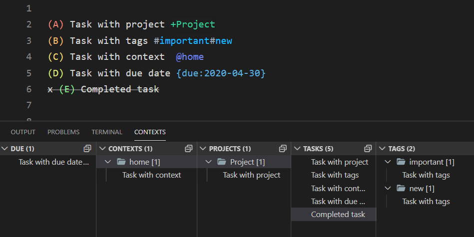

Based on [todo.txt](https://github.com/todotxt/todo.txt) format.

## ❗ Extension does not conform to the `todo.txt` spec.
## ❗ Extension is in Alpha phase



By default works for files with names `todo.md` & `todo.archive.md` (But can be changed with `activatePattern` setting).

# Features

## Projects

```
+Project
```

## Context

```
@context
```

## Tags

```
#tag1#tag2
```

## Special tag:value pairs

```
{due:2020-04-30}
```

List of special tags:

tag | description
--- | ---
`due` | Due date
`cm` | Completion date

<!-- - ❌ id (UUID)
- ❌ id/p (dependent task / blocked task?)
- ❌ t (threshold)
- ❌ rec (Recurrence)
- ❌ h (hide)
- ❌ f/star (favorite/starred)
- ❌ url/link
- ❌ e (effort)
- ❌ note
- ❌ cr - (creation date) -->

## Comments

Comment is not considered a task. It starts with a sharp sign `#` followed by a space.

```
# comment
```

# Commands

- `todomd.toggleDone` <kbd>Alt</kbd>+<kbd>D</kbd> - Toggle Done (Completion)

# Settings

|Name|Default|Description|
| --- | --- |--- |
|activatePattern|`"**/{todo,todo.archive}.md"`|Choose files that extension will operate on. By default activated on 2 files (`todo.md` & `todo.archive.md`). This format is called `Glob`. Examples:<br>Activate on any (.txt) file - `**/*.txt`.<br>Activate only on single file (todo.txt) - `**/todo.txt`<br>Activate on 2 files (todo.txt or task.txt) - `**/{todo,task}.txt`|
|addCompletionDate|**false**|When completing a task add completion date to it: `{cm:2020-04-30}`|